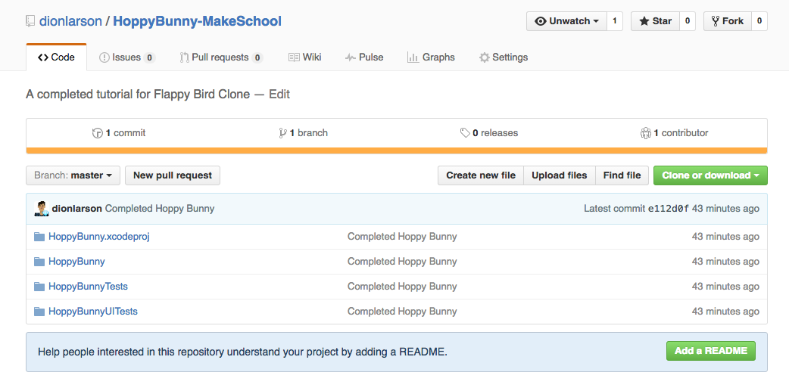
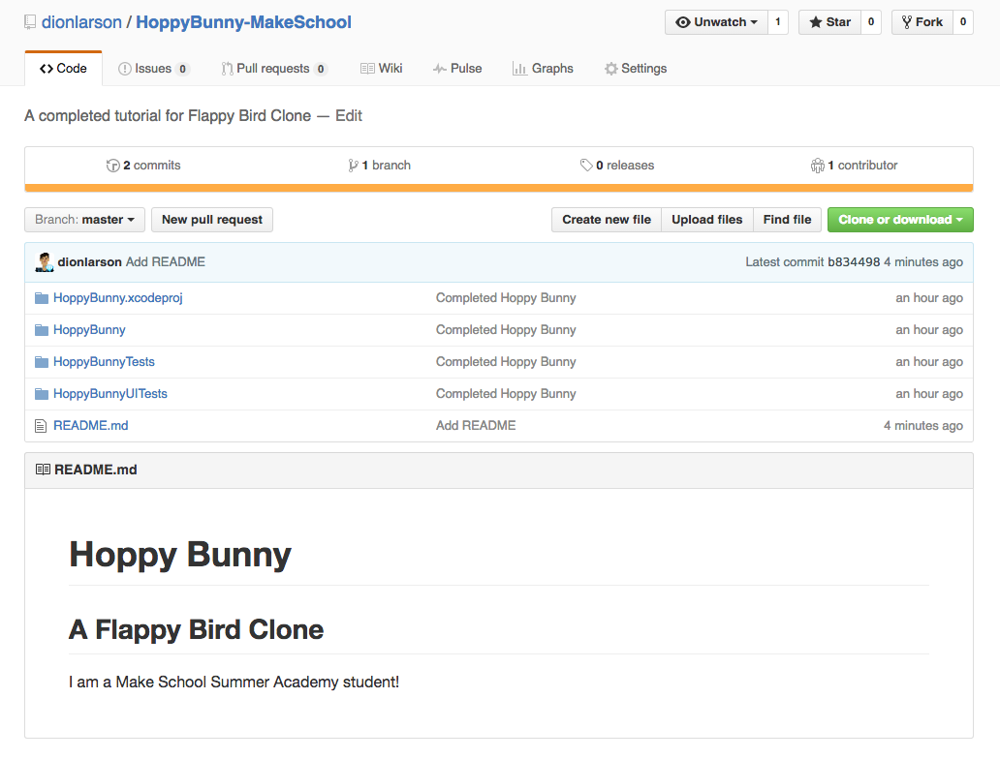

When using Git, each project gets its own *repository*. The repository (or *repo*) holds the project and its commits (snapshots of the files). Since Git is *distributed*, you usually have a *local repository* and a *remote repository*. The local repository exists on your computer. The remote repository is usually hosted by a service such as [GitHub](https://www.github.com/). This means you'll still have a copy of your project if your computer goes missing or stops working.

#Create a GitHub account

Before we go any further, you will need to create a GitHub account. Your GitHub account will function as a professional portfolio of your work so be sure to choose a professional username that you won't be embarrassed to put on your résumé!

> [action]
> Go to [GitHub](https://github.com/join) and create an account with a professional username. Choose *Free* on step two.
>
> You can skip this step if you already have a GitHub account!

#Download GitHub Desktop

There are a few ways to use Git but we would like everyone to get started with _GitHub Desktop_. It's a great, graphical interface and allows you to take advantage of all of Git's features.

> [action]
>
1. Download GitHub Desktop from [here](https://desktop.github.com/).
1. "Unzip" the downloaded `.zip` file by double-clicking on it.
1. Open up your applications folder and drag _GitHub Desktop_ into it
1. Drag _GitHub Desktop_ from the applications folder onto your dock so you can access it easily.

#Getting started

We need to set up _GitHub Desktop_ before we can create a repository.

> [action]
>
1. Open up _GitHub Desktop_ and start going through the setup prompts.
1. Sign into your GitHub account.
1. Fill out your full name and email address (be sure to use the one you signed up for GitHub with).
1. You do not need to install the command line tools.
1. Skip adding any existing repositories.

#Committing and pushing

Earlier, we talked about *commits* or snapshots. We already finished a project so we want to create a single commit of the final results. When we do that we'll also *push* that commit to GitHub so it's backed up and added to our quickly growing portfolio. We'll do this for each project we've already finished and then start doing it as we build new projects!

There are three steps to getting your files onto GitHub: *staging*, *committing*, and *pushing*. We will *stage* all the project files (by making sure they are checked to be included in the commit). This is like arranging the subjects of your snapshot (hence "staging" a photograph). A *commit* only includes files that are staged, so if we do not stage any files, we will not commit anything. Once all the files are in *staging*, we will *commit* (take the snapshot) and *push* (share the snapshot with GitHub). This will create a *commit* in our local repository and *push* it to our remote repository on GitHub.

#Creating your first repository and committing the files

Before we create our first repository, let's make sure we are organized.

> [action]
> ## Getting organized
>
1. Save everything and close Xcode
1. Create a new folder somewhere to store all your projects. Your Desktop or Documents would be a good place! Name the new folder `Make School Projects` and drag all your previous projects into it.

<!--  -->

> [info]
> You can create a new folder by right-clicking and selecting `New Folder`. You can rename a folder by right-clicking on it and selecting `Rename`.

Alright! Now that we have organized our projects, let's create a new repository!

> [action]
> ## Initial commit
>
1. Open _GitHub Desktop_ and your projects folder.
1. Drag your first project (not the whole projects folder) into _GitHub Desktop_.
1. If there's a `This folder is not a repository` popup, click `Create and Add`.
1. Select the project from the sidebar if it is not active. You should be on the `Uncommitted changes` tab.
1. Make sure all the files are checked. If they are checked, then they are *staged* and ready to be *committed*!
1. Enter a short message in `Summary`. This will usually describe what you changed between the last commit and this new one. In our case, we are committing a completed project so something like "Completed <project name>" would work.
1. Click `Commit to Master`.
1. You should see the outline of a circle added to the timeline at the top and the window should say `No Changes`.
>

Congrats! You just created your first local repository! There is just one problem... it has not been *pushed* to *GitHub* yet! This repository only exists on your computer. The outline of a circle means that commit has not yet been *pushed*. Once it's *pushed*, it will be filled in.

> [info]
> If you only wanted to commit a few changed files, you could pick and choose by unchecking the files to *unstage* them. In this case we wanted all of them so we left them all checked.

# Creating a remote repository

So, how do we create a remote repository on _GitHub_? Lucky for us, this is the _GitHub Desktop_ app and we don't even need to open a browser!

> [action]
>
1. Notice how the commit added is represented by the outline of a circle. This means that they commit is only in our local repository!
1. Click the `Publish` button at the top right.
1. In the popup, give your repository a name. This should be the name of your project.
1. You can enter a short description as well if you would like. This is a good place to describe your project, what language you used (Swift), and what platform it was created for (iOS).
1. Click `Publish Repository`
1. Notice how the commit is now represented by a filled in circle. This means it has been *pushed* to the remote repository :)
>

If you want, you can even view the project on _GitHub_. Just right click on the project in the sidebar and select `View on GitHub`. Your browser will open up directly to the repository. Now it's on _GitHub_ and you have started a development portfolio!

# Commit and push again!

Now, what happens if you make changes to your project after your first commit? We just *commit* and *push* (sync) again!

> [action]
> Let's say you wanted to add a README file to your project. README's are displayed at the bottom of your _GitHub_ page and allow you to go into more detail about your project.
>
1. Download [this pre-made README](https://github.com/MakeSchool-Tutorials/Git-GitHub-Intro/raw/master/P1-Your-First-Repo//README.md).
1. Drag it into your project's folder.
1. Click the `Uncommitted Changes` tab to activate it.
1. You should see one file *staged* and ready to be committed.
1. Put "Add README" in the `Subject`.
1. Click `Commit to master` and you should see the outline of a new circle added to the timeline. What does an circle outline mean? It means that you have committed but still need to *push* (sync)!
1. Press the `Sync` button and watch the circle fill in!
>

Right click on the project in the sidebar and select `View on GitHub`. Your browser will open up directly to the repository. What a pretty `README` :)

> [info]
> You will go through this *commit* and *push* (sync) cycle every time you finish making changes to your project. Remember to use descriptive commit subjects and keep it professional! Your commit subjects can be read on your _GitHub_.
